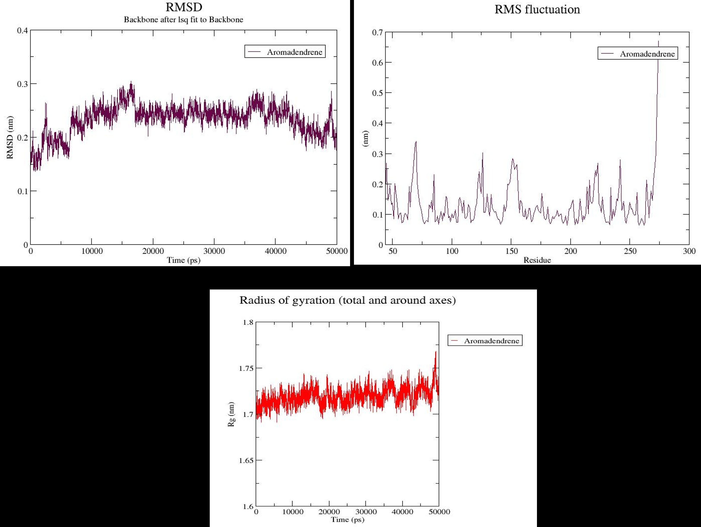
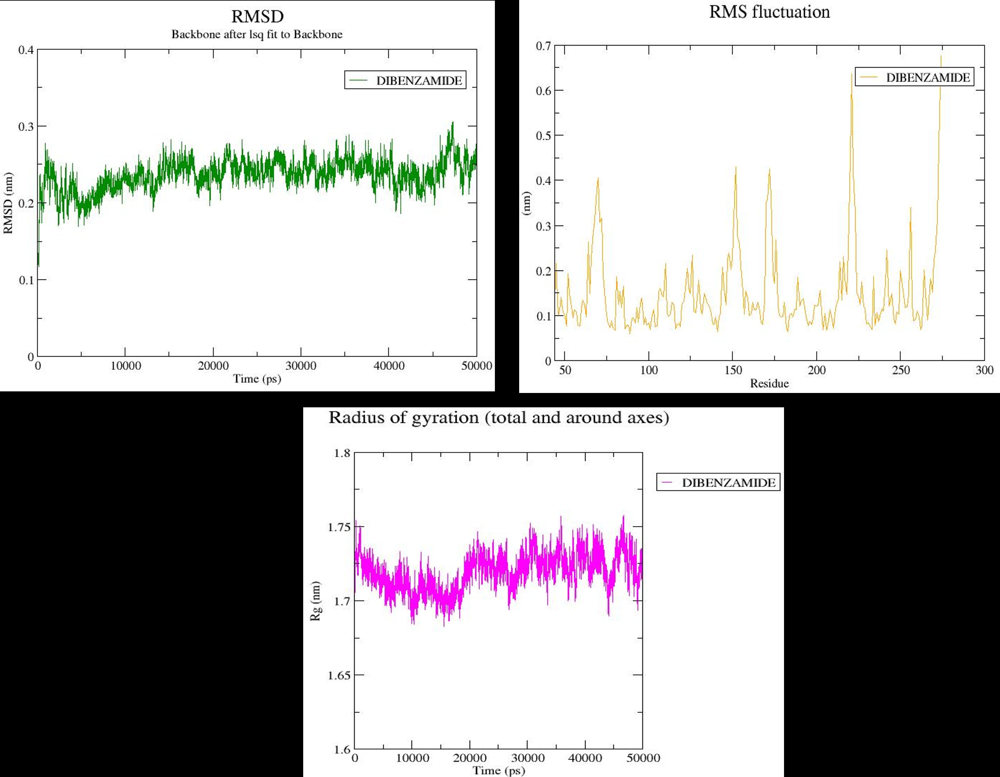

# Structure-Based Virtual Screening of Phytocompounds Against NDM-1 in Carbapenem-Resistant *Klebsiella pneumoniae*

## Overview

NDM-1 is a key resistance enzyme driving carbapenem-resistant *Klebsiella pneumoniae* infections, with very few treatment options once acquired. This project screened phytochemicals from two medicinal plants — *Trachyspermum ammi* (Ajwain) and *Plectranthus amboinicus* (Karpooravalli) — against NDM-1 using a structure-based computational drug discovery pipeline, aiming to identify plant-derived inhibitor candidates for future antimicrobial development.

## Aim & Objectives

**Aim:** Identify plant-derived NDM-1 inhibitors in *K. pneumoniae* via structure-based computational screening.

- Understand the role of NDM-1 in mediating antibiotic resistance in *K. pneumoniae*
- Screen selected plant-based phytocompounds against NDM-1 computationally
- Perform molecular docking to evaluate binding affinity and inhibitory potential
- Analyze protein–ligand interactions and predict pharmacokinetic/toxicity (ADME/T) properties
- Run molecular dynamics simulations on top-hit complexes to assess structural stability

## Methods Summary

- **Target structure:** NDM-1 crystal structure (PDB ID: 3SPU; King & Strynadka, 2011), prepared in BIOVIA Discovery Studio Visualizer — chain A retained, zinc cofactors kept, waters/heteroatoms removed
- **Ligand library:** ~200 phytocompounds curated from Ajwain and Karpooravalli, structures retrieved from PubChem
- **Molecular docking:** PyRx (AutoDock Vina algorithm), blind docking across the full protein surface
- **Interaction analysis:** BIOVIA Discovery Studio Visualizer — hydrogen bonds, hydrophobic/π-interactions, metal coordination
- **ADME/T profiling:** SwissADME, pkCSM, and ProTox-II — Lipinski's Rule of Five, toxicity endpoints (AMES mutagenicity, hERG inhibition, LD50)
- **Reference inhibitors:** Thiorphan, D-Captopril, L-Captopril (docked under identical conditions for comparison)
- **Molecular dynamics:** GROMACS, 50 ns production runs on top lead complexes; RMSD, RMSF, and radius of gyration (Rg) used to assess stability

## Results

### Docking Screen

Of ~200 initially screened compounds, **23 were shortlisted** based on binding affinity (12 from Ajwain, 11 from Karpooravalli). Several phytocompounds showed binding energies stronger than all three reference inhibitors (Thiorphan: −5.3, D-Captopril: −5.1, L-Captopril: −5.0 kcal/mol).

Full results: [`results/Docking_analysis_result/NDM-1_docking_results.csv`](results/Docking_analysis_result/NDM-1_docking_results.csv) · Reference inhibitor scores: [`results/Docking_analysis_result/NDM1_reference_inhibitors_docking.csv`](results/Docking_analysis_result/NDM1_reference_inhibitors_docking.csv)

| Rank | Compound | Source | Binding Affinity (kcal/mol) |
|---|---|---|---|
| 1 | β-Amyrin | Karpooravalli | −12.3 |
| 2 | Eudesmol | Ajwain | −8.7 |
| 3 | Isoaromadendrene epoxide | Karpooravalli | −8.2 |
| 4 | Aromadendrene | Ajwain / Karpooravalli | −8.0 |
| 5 | Apigenin-7-O-glucoside | Ajwain | −7.6 |

*(Full ranked list of all 23 compounds in the CSV above.)*

### Protein–Ligand Interaction Analysis

Key active-site residues — **His122, Asp124, Trp93, His250, Lys211** — recurred across multiple compounds, indicating a consistent, druggable binding region. Several top compounds (Apigenin-7-O-glucoside, Luteolin) formed direct metal-coordination contacts with the catalytic Zn²⁺ ions, suggesting a plausible mechanism for enzyme inhibition.

**Interaction profile — all 23 compounds plus reference inhibitors:** ([full data: raw CSV](results/interaction_analysis/NDM1_interaction_residues.csv))

| Compound | CID | Source | Interacting Residues | Interaction Types |
|---|---|---|---|---|
| β-Amyrin | 73145 | Karpooravalli | His122, His250 | van der Waals, π-Alkyl, π-sigma |
| Aromadendrene | 11095734 | Ajwain | Tyr184, Leu144, Ala143 | van der Waals, Alkyl, π-sigma |
| Apigenin-7-O-glucoside | 5280704 | Ajwain | His122, Asp124, Trp93, Zn301 | van der Waals, Conv. H-bond, Metal-acceptor, π-Alkyl |

*(Full 26-row table — all 23 compounds plus 3 reference inhibitors — in the CSV linked above.)*

2D interaction diagrams for the top leads from each plant are available in [`results/interaction_analysis/`](results/interaction_analysis/) — [Ajwain - top 3 leads](results/interaction_analysis/2d_interaction_ajwain_top3.png) · [Karpooravalli - top 3 leads](results/interaction_analysis/2d_interaction_Karpooravalli_top3.png)

### ADME/T Filtering

All 23 compounds were evaluated for drug-likeness and toxicity. Compounds violating Lipinski's Rule of Five were excluded. Final leads carried forward:

- **From Ajwain:** Aromadendrene, Apigenin-7-O-glucoside, Luteolin
- **From Karpooravalli:** Aromadendrene, Dibenzamide, Ledene, δ-Gurjunene

All final leads were predicted **AMES-negative** (non-mutagenic) and **non-hERG-inhibitors**, with acceptable LD50 values — indicating a favorable predicted safety profile.

**Pharmacokinetic & toxicity properties of the 7 lead compounds, compared against reference inhibitors:** ([full data: raw CSV](results/NDM1_ADMET_top_leads.csv))

| Compound | Source | Mol. Wt (g/mol) | LogP | Acceptor-HB | Donor-HB | PSA (Ų) | AMES Toxicity | hERG Inhibitor | LD50 (mol/kg) |
|---|---|---|---|---|---|---|---|---|---|
| Aromadendrene | Ajwain | 204.35 | 4.34 | 0 | 0 | 0.00 | No | No | 1.526 |
| Apigenin-7-O-glucoside | Ajwain | 432.38 | 0.52 | 10 | 6 | 170.05 | No | No | 2.595 |
| Luteolin | Ajwain | 286.24 | 1.73 | 6 | 4 | 111.13 | No | No | 2.455 |

*(Full table — all 7 leads plus 3 reference inhibitors — in the CSV linked above.)*

*Note: the terpene-class leads (Aromadendrene, Ledene, δ-Gurjunene) show LogP values above the Lipinski threshold (>4.2) with zero polar surface area — typical of highly lipophilic terpenoids. They were retained as leads because they passed all toxicity screens (AMES, hERG, LD50) despite this single LogP flag, which is a judgment call worth noting rather than a strict pass/fail.*

### Molecular Dynamics Simulation (50 ns)

**Aromadendrene** and **Dibenzamide** — the top-ranked lead from each plant source — were carried forward into 50 ns MD simulations to assess complex stability.


*Aromadendrene–NDM-1 complex: RMSD stabilized within 0.22–0.27 nm after ~15 ns; Rg remained stable at ~1.70–1.75 nm, indicating a compact, stable complex throughout the simulation.*


*Dibenzamide–NDM-1 complex: RMSD remained within 0.20–0.28 nm with slightly higher residue-level flexibility than Aromadendrene, but no major structural deviations.*

Both complexes maintained stable RMSD, RMSF, and Rg profiles across the full 50 ns run, supporting the docking-predicted binding modes.

## Conclusion

Several phytocompounds from Ajwain and Karpooravalli — most notably **Aromadendrene**, which showed strong, consistent binding and a stable 50 ns MD trajectory — emerged as promising candidate inhibitors of NDM-1, with binding affinities exceeding established reference inhibitors (Captopril, Thiorphan). These results support plant-derived compounds as a viable starting point for further inhibitor development against carbapenem-resistant *K. pneumoniae*, pending experimental (in vitro/in vivo) validation.

## Repository Structure

```
results/
├── Docking_analysis_result/
│   ├── NDM-1_docking_results.csv           # Docking scores, all 23 compounds
│   └── NDM1_reference_inhibitors_docking.csv  # Docking scores, 3 reference drugs
├── interaction_analysis/
│   ├── 2d_interaction_ajwain_top3.png       # Top 3 Ajwain interaction diagrams
│   ├── 2d_interaction_Karpooravalli_top3.png # Top Karpooravalli interaction diagrams
│   └── NDM1_interaction_residues.csv        # Residue interactions, all 23 + 3 refs
├── mds_analysis/
│   ├── MD_simulation_aromadendrene.jpg      # 50 ns MD: RMSD/RMSF/Rg
│   └── MD_simulation_dibenzamide.jpg        # 50 ns MD: RMSD/RMSF/Rg
└── NDM1_ADMET_top_leads.csv                 # ADME/T data, 7 leads + 3 refs
README.md
```

## Future Work

This project is being extended toward a manuscript, with two directions currently in progress:

- **Extended molecular dynamics simulations** — the thesis's lead compounds are being re-simulated for longer trajectories (up to 100 ns, extending beyond the thesis's original 50 ns) for stronger validation of complex stability.
- **Independent subtractive genomics pipeline** (own ongoing work, separate from the thesis) on the *K. pneumoniae* proteome — CD-HIT redundancy removal → BLASTp filtering against human and Swiss-Prot proteomes — to identify novel candidate drug targets beyond NDM-1, including virulence-associated and iron-acquisition targets (e.g., DsbA oxidoreductase, yersiniabactin biosynthesis proteins).

## Tools & Key References

PyRx/AutoDock Vina (Dallakyan & Olson, 2015) · BIOVIA Discovery Studio Visualizer · SwissADME (Daina et al., 2017) · pkCSM (Pires et al., 2015) · ProTox-II (Banerjee et al., 2018) · GROMACS (Van Der Spoel et al., 2005) · NDM-1 structure: King & Strynadka, 2011 (PDB: 3SPU)

---

**Author:** Lakshmikala RS<br>
M.Sc. Bioinformatics<br>
Interested in Genomics, AMR studies, and Computational Biology

If you use this work, please cite:

> Lakshmikala, R.S. (2026). *Structure-Based Discovery of NDM-1 Inhibitors in K. pneumoniae.* GitHub Repository: https://github.com/lakshmikalars/NDM1-K.-pneumoniae-drug-discovery
